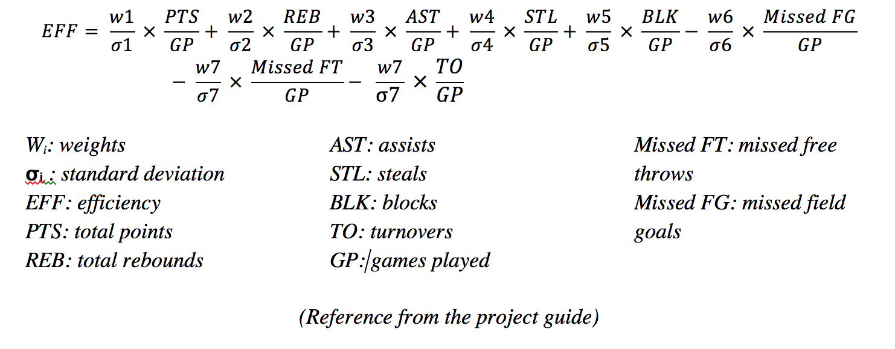
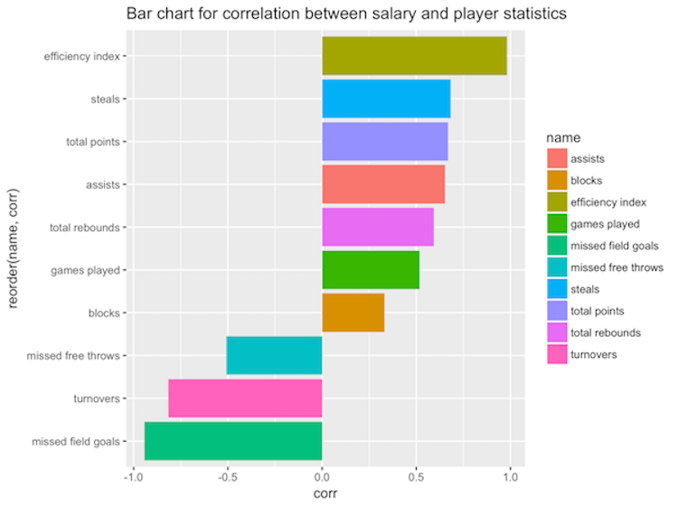
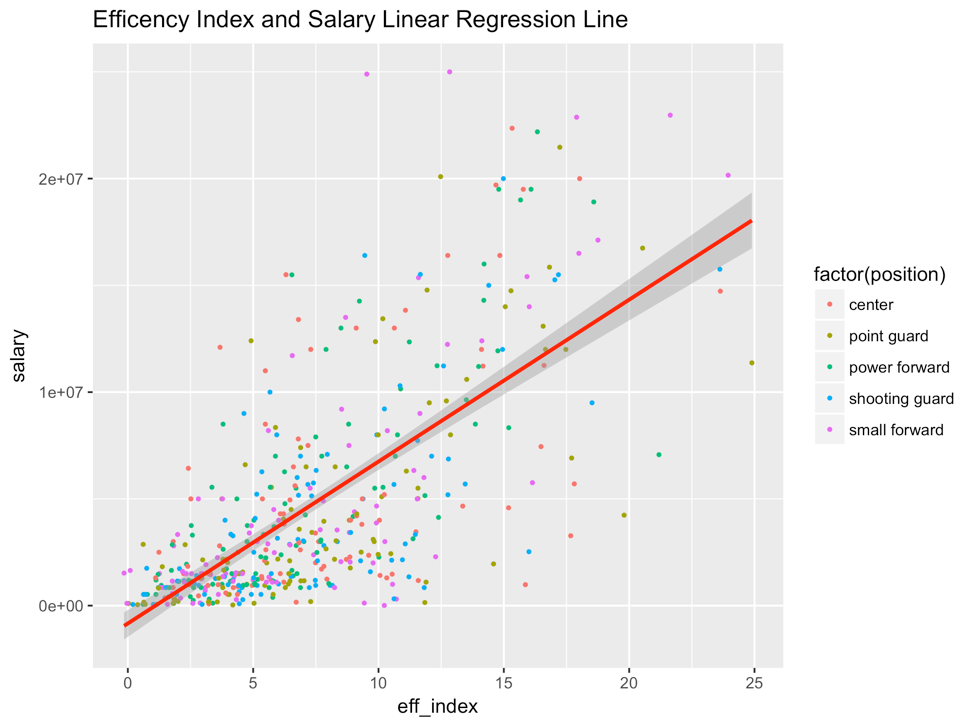
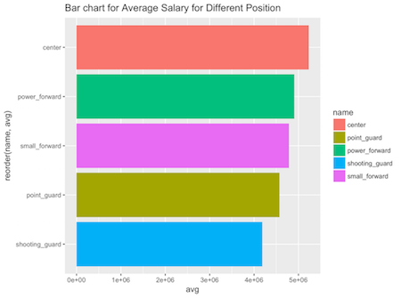
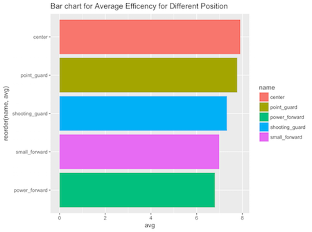
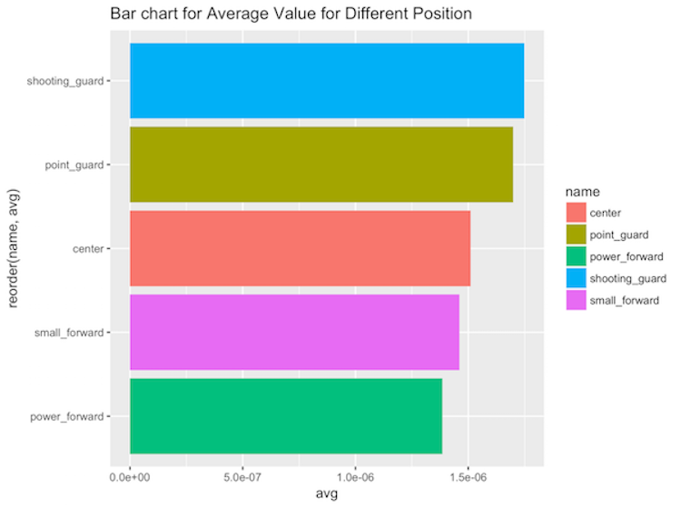

* [Abstract] []
* [Introduction] []
* [Data] []
* [Methodology] []
    + [Data Acquisition] []
    + [Data Cleaning] []
    + [Exploratory Data Analysis (EDA)] []
    + [Team Statistics] []
    + [Shiny app “team-salaris”] []
    + [Player Performance] []
    + [Player Value] []
    + [Shiny app “stat-salaries”] []
    
* [Results] []
    + [Player Skill Analysis] []
    + [Player underpaid or overpaid] []
    + [Player Position Analysis] []
* [Conclusions] []

# Abstract
The project focuses on the dataset of basketball players from 
National Basketball Association (NBA) League in the 2015-2016 season. It studies the relationship between these players’ performance and their salaries. The major questions include how to evaluate players’ performance, what basketball skills the salaries have higher association with, how players’ positions can influence their performance and salary, and whether the players are underpaid or overpaid. To tackle these problems, we adopted several key approaches, which include measuring the efficiency index, aggregating salaries by team, measuring correlation between salary and each skillset, and calculating efficiency-salary ratio as a value index. During implementation process, we constructed a data analysis pipeline that includes data acquisition, data cleaning, data visualization and data analysis. This paper will explain the methodologies and process in our implementation, as well as discuss the results from our analysis. 

# Introduction

An NBA player’s salary is first determined by his rookie rankings, and all the rookies’ salaries are not too high. Each five-year-period is like a stage for a player, because he can get a big jump on his salary. Moreover, holding a long-term contract with NBA, a player can get a salary increase of up to 5 percent each year. Potential salary increase takes into account a lot of factors, such as NBA’s financial constraints, salary cap and the so-called “average salary policy.” However, the most important factor is the player’s on-court performance. In our project we will mainly explore this part and study the relationship between the player’s performance and his salary.

There are three main parts in our project: Data, Methodology and Results. Data explains the legitimacy of our source data, and the process of scraping and cleaning. Methodology provides a thorough description of our approaches, including the logistics of the evaluation formula we used. It explains why we chose to use these approaches and why they matter. Lastly, Results provides an analysis of the results from the above methods. It answers the questions we projected earlier based on statistical analysis of the data.

# Data 
The National Basketball Association (NBA) is the men’s professional basketball league in North America. The NBA league was founded in New York City in 1946 and is considered as one of the major professional sports leagues in the United States and Canada. 

We used the NBA data sets from Basketball Reference, Sports Reference LLC, the website provides statistics, scores, and history for famous sports competition. We work with three raw data tables: Roster, Totals (player statistics), and Salaries for 30 teams in NBA in season 2015-2016. The Roster, Totals and Salaries table contains information about each player’s name, position, height, weight, birthday, country of origin, years of experience, attended college, age, games played, games started, minutes played field goals, field goal attempts, some other related skills statistics and salaries. The format of table is obtained from html table in web page and saved as CSV format in local.

# Methodology

#### Data Acquisition
We used scrape-nba-tables.R given by the professor as foundation, and applied functions in the library XML to write another script to get the raw data of 30 basketball teams. We set a for loop to read each team’s data. For each team, we first read the html document as a character vector. Then, since it has too many tables on a html web page, we initiated the line position of roster html table as the place where we started reading. Also, we used the variable `line_counter` to select the specific line we started and stopped. Since we need 3 types of table for each team, roster, totals and salaries, we need to set `begin_totals` and `begin_salaries` just like `begin_roster`. We also used line_counter to find the line where the html ends for these 2 tables. For each table, we use write.csv to save the data in a CSV file. In the end. We were able to get 90 CSV files of raw data.

#### Data Cleaning
After fishing the raw data, we got 3 folders: roster-data, salary-data and stat-data. Then, we merged all 90 csv files together (30 files in each file). Because there are duplicate players who attended in multiple teams, we used duplicate() to check who attended in multiple teams and removed them. After then, we used `str_split`, `str_replace_all` and some switch functions to reformat data to facilitate future data analysis. We created a new data frame with all variables that had ever appeared in the 90 files, and changed the abbreviated format to be full name. Lastly we used the write.csv to save it as roster-salary-stats.csv in directory data/cleandata.
    

#### Exploratory Data Analysis (EDA)
We explored every potential feature (skill) that could influence salary. There are 36 features, and the feature data are either quantitative or qualitative. For each quantitative feature, we calculated descriptive summaries (mean, median, min, max, 25% quantile, 75% quantile, IQR, sd and range of the data) and plotted a histogram and a boxplot. For qualitative feature, we computed the frequency and plotted a bar chart. Then, we output those results to a text file called eda-output.txt. In the above process, we mainly used functions in libraries readr, ggplot2 and dplyr.

#### Team Statistics
We computed a salary summary for each team. Each summary contains ten variables:

	* team name
	* total payroll : the sum of each team’s salary column 
	* minimum salary: the min of each team’s salary column
	* maximum salary: the max of each team’s salary column.
	* first quartile salary: the 25th quantile of each team’s salary column
	* median salary: the median of each team’s salary column
	* third quartile salary: the 75th quantile of each team’s salary column
	* average salary: the mean of each team’s salary column
	* interquartile range: the range between 25th and 75th quantile
	* standard deviation: the standard deviation of each team’s salary column
We used a for loop to compute summary for each team, and created a new dataframe `team_salary_data` to store them. In the end, we saved them into team-salaries.csv.

#### Shiny app “team-salaris”
Team salary shiny app is used for visualizing the relationship between different team statistics in box charts. In the user interface of the app, we provide for the users three widgets to select the desired statistics for plotting. The users can decide whether to display the bars in decreasing or ascending order, and whether to show the legends. Defaultly we set each input as `total_payroll`, the order of displaying bars as descending, and the legend as shown. For better user experience, we set the possible inputs for “statistics” and “display order” as option box and checkbox button for “show legend” option. The result plots will be displayed in the right hand side of the web page. For the server side of the app, we declared all the functions used for plotting the output plot in a separate shiny-team-salaries.R. In the file, we declare function `load_team_salary` for loading data from team-salaries.csv, `get_stats` for getting data for specific column from user’s input, and plot_stats for plotting bar charts by ggplot2 package.  

#### Player Performance
We computed each player’s performance as an index based on “efficiency” statistics (EFF). EFF is one of the most common benchmarks of evaluating a professional basketball player’s value. EFF takes into account the player’s number of points, rebounds, assists, steals, blocks, turnovers, and shot attempts in one game. However, because EFF favors offense specialized players over defense specialized players, we used a modified EFF by adding weights to each feature, and these weights are based on Principal Components Analysis (PCA). The modified EFF formula is written as

For specific implementation, we first extracted total points, total rebounds, assists, steals, blocks, turnovers and games played from the original data. Then, we used the difference of free throws and attempted free throws from original data to calculate missed free throws; similarly, we compute missed field goals by subtracting field goals from attempted field goals. After getting all features needed, we normalized each player’s features by the name of games he played. It should be noted that missed field goals, missed free throws, and turnovers have negative influence on a player’s performance, so we took the negative value of those three columns. Finally, we divided players into different positions they hold and calculate EFF separately. For each position’s players, we computed PCA weights using the function prcomp() (note: we only take the first principal component). After extracting the weights, we performed linear combination of the eight features with weights as coefficients to obtain efficiency index. In the end, we concat all the position subsets into a complete table.

#### Player Value
To evaluate a player’s value, we simply took the ratio between his efficiency index and salary. Therefore, player’s value is influenced by both performance and salary. Performance has a positive influence on value, while salary has a negative influence. We will only focus on the top twenty players and the bottom twenty.

#### Shiny app “stat-salaries”
Stat salary shiny app is used for visualizing the relationship between all the player statistics in scatter charts and that about how players’ positions affect their statistics. For the user interface of the app, we set up three input widgets for the users to select x-axis variable and y-axis variable from a list of available options. The users can choose whether to display the dot in scatter plot in difference color according to a player’s position. There is one output widget to display computed correlation coefficient, and there is text to explain the detailed information about the abbreviated name for the player’s position. We set “total points” to be the default value for x-axis statistics and “salary” to be the default value for y-axis statistics, and the color by position to be true. Under these two select-box-input, the app displays the full name for each abbreviated player’s position name for clarification. Then, the correlation coefficient is displayed at the bottom of the left panel. After users change these inputs, the result plots will be displayed in the right hand side of the web page. For the server side of the app, we declared all the functions used for plotting the output plot in a separate shiny-stat-salaries-function.R. In the file, we declared function `load_team_eff` and `load_team_position` for loading data frame, `get_stats` for getting data for specific column from user’s input, and plot_stats for plotting bar charts by ggplot2 package. Moreover, we had a function for computing the correlation coefficient of the two variables that user selected and for updating the correlation coefficient everytime after the users select desired statistics to be plotted.

# Results

#### Player Skill Analysis

From the graph, we can see that the efficiency index has the strongest correlation with salary 
(r = 0.994, extremely close to 1). The data indicates that players who have high performance are more than likely to be paid well. And we can deduct that the efficiency index is a key factor in calculating a player’s salary. It is reasonable because efficiency index is computed from a weighted combination of all the other skills, so it is a comprehensive evaluation of a player’s performance. Moreover, number of missed field goals has the second strongest impact on salary, although its impact is negative. On the other hand, the feature that has the lowest absolute correlation with the salary is number of blocks (r = 0.337). It means that number of blocks does not affect a player’s salary much compared to other features. A block occurs when a defensive player legally deflects a field goal attempt from an offensive player. Although a block decreases the opponent team’s chance to score, it will not directly influence the score of the player’s team. And usually a block is executed successfully due to natural advantage of a player such as height, so the actual skill required is relatively low compared to other features.

After discussing the extreme values, we proceed to investigate the features that have positive and negative impact separately. Among all features that have negative correlations, the order of influence is the following:
1.	Missed field goals
2.	Turnovers
3.	Missed free throws
we can see that the number of missed field goals has the highest absolute correlation (r = -0.939) with salary. When a player missed a lot of field goals this year, his salary is highly likely to be low. Field goal refers to a basket scored on any shot or tap. One assumption is that field goals are more technique oriented than free throws, which are more affected by the factors of experience and luck. So we can see that the correlation of number of free throws is approximately 0.4 higher than that of field goals (0.4 lower in absolute value). The correlation of number of turnovers is between that of missed field goals and missed free throws, but its absolute value is still relatively high, which means it still has a relatively high negative impact on the salary. 

Among features that have positive impacts, the order of influence is the following:
1.	Efficiency index
2.	Steals
3.	Total points
4.	Assists
5.	Total rebounds
6.	Games played
7.	Blocks
We have already discussed efficiency index and blocks, so we will focus on analyzing the ordering of the rest. We can see that steals and total points have relatively high impact. And their correlations are very close to each other (0.684 versus 0.685). It is reasonable for total points feature to have high correlation because it directly influences the outcome of a game and it is an objective evaluation of a player’s performance. But it is interesting to see that the number of steals also influence the salary a lot. On the other hand, number of total rebounds and number of games played have relatively lower correlation, especially the number of game played (r = 0.5). We can deduct that a player’s experience is considered less important compared to the other skills that can directly reflect a player’s current performance.

#### Player underpaid or overpaid

In this salary-efficiency plot, we plot a regression line indicating the projected salary based on efficiency. So the position of a point (player) relative to the regression line indicates if this player is underpaid or overpaid. To be specific, the points above the regression line represent overpaid players, because their actual salaries are higher than the expected ones. And the points under the regression line represent underpaid players since their actual salaries are lower than expected ones. 

Observing the concentration of points at different parts of the graph, we see that the points are scattered mostly under the regression line and around the bottom left corner. It means that the lower efficiency (performance) players are more likely to be underpaid. And even most of the overpaid low efficiency players are scattered close to the line, which means they are not overpaid much. On the other hand, the high efficiency (bigger than 20) players are scattered more further away from the line, and the number of overpaid players exceed that of underpaid. A possible explanation of such a situation is that NBA has salary cap and financial constraints when it comes to salary. Usually high efficiency players boost the performance of this team by a lot, so the team will choose to pay super stars (high efficiency players) a large amount of money to attract them. In order to meet the financial constraints, it will choose to decrease the salary of the low efficiency players. Therefore, low efficiency players tend to be underpaid, while high efficiency players tend to be overpaid.

#### Player Position Analysis 
Regarding the same graph from above, the colors are differ based on positions, so we can derive the underpaid/overpaid situation for each position from this graph. However in general, the positions are spread considerably evenly, and we cannot derive anything significant. Therefore, we tried analyzing the average efficiency, value and salary for different positions separately.

   

If we compare the bar chart of average salary with that of average efficiency, we find that center players are paid the most, and they also have the highest efficiency. This is reasonable because our expectation derived from the skill analysis states that efficiency has an extremely strong correlation with salary. However, the rest of the positions slightly deviate from this conclusion. Power forward players have the second highest salary, while their efficiency is the lowest. Small forward players reach a better balance between efficiency and salary; their orders only differ by one. Point guard players have the second lowest salary, while their efficiency is the second highest. Shooting guard players have the worst pay on average, but their efficiency is at the middle level. 
If our assumption is that a player’s efficiency should be positively correlated with his salary, we can say that on average shooting guard and point guard players are underpaid, while power forward and small forward players are overpaid. For clarification, underpaid indicates an unbalance between relatively high efficiency and low salary, while overpaid indicates an unbalance between relatively low efficiency and high salary. Therefore, defensive positions are on average underpaid, while offensive positions are overpaid.

The last graph indicates the average value of each position. Value is computed by dividing efficiency by salary, so in general, underpaid players have high values while overpaid ones have low values. Thus, the underpaid point guards and shooting guards have the highest values, while power forward and small forward players have the lowest values.

# Conclusions

Considering the results we derived from the data, we are able to answer the three questions we brought out at the beginning. First of all, different skills do have very different impact on the salary. Among them, efficiency, a performance evaluation index that considers all skills, projects the highest correlation with salary. For single skills, the number of missed field goals has the strongest negative impact on salary, while steals and total points contribute to high positive impact on salary. Moreover, we analyzed the underpaid and overpaid situations by looking at the balance between efficiency and salary, and we concluded that low efficiency players are more likely to be underpaid while high efficiency players are the opposite. Based on the assumption of positive correlation between efficiency and salary, we also derived that point guards and shooting guards are underpaid on average, while power forward and small forward players are overpaid on average. 
 
However, the conclusions are purely based on this specific dataset, which might not be comprehensive enough to make a bias-free analysis. For example, some teams might be lack of center players, so it is reasonable that the center players will get higher salary. Moreover, superstar rookies have great performance but do not necessary have high salary because of certain policies in the team. Even personal relationship with the team captain and manager might affect the salary. In conclusion, although on-court performances affect a player’s salary to the most extent, our data does not necessary include every possible factor that could influence the salary.

