Stat 133 Fall 2016 Final Project 
========================================================
author: Xuran Zhang, Xuanpei Ouyang, Yujia Luo, Yulong Yin  
date: 12/02/2016  
autosize: True  
  

Content
========================================================

- Introduction
- Data
- Methodology
- Results
- Conclusion

Introduction
========================================================

This project focuses on the dataset of basketball players from National Basketball 
Association (NBA) League in the 2015-2016 season. We wil analyse the relationship between these players’ performance and their salaries.  

 

Data
========================================================
We used the NBA data sets from Basketball Reference, Sports Reference LLC,for 30 teams in NBA in season 2015-2016.

Methodology
========================================================
- Data Cleaning
- EDA
- Team Statistics
- Player Performance
- Player Value
- Shiny apps 

Data Cleaning
========================================================
- merge(): roster, totals, and salary tables for each team
- cbind(): Stack all the tables
- duplicated(): check duplicate players
- Remove duplicated players  

EDA
========================================================

For EDA we have 2 types of data, quantitative data and qualitative data.  
We use bar chart to analyze qualitative data.
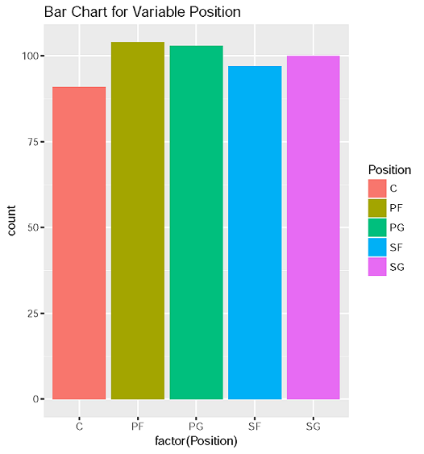  

EDA
========================================================

We use box plot and histogram to analyze quantitative data  
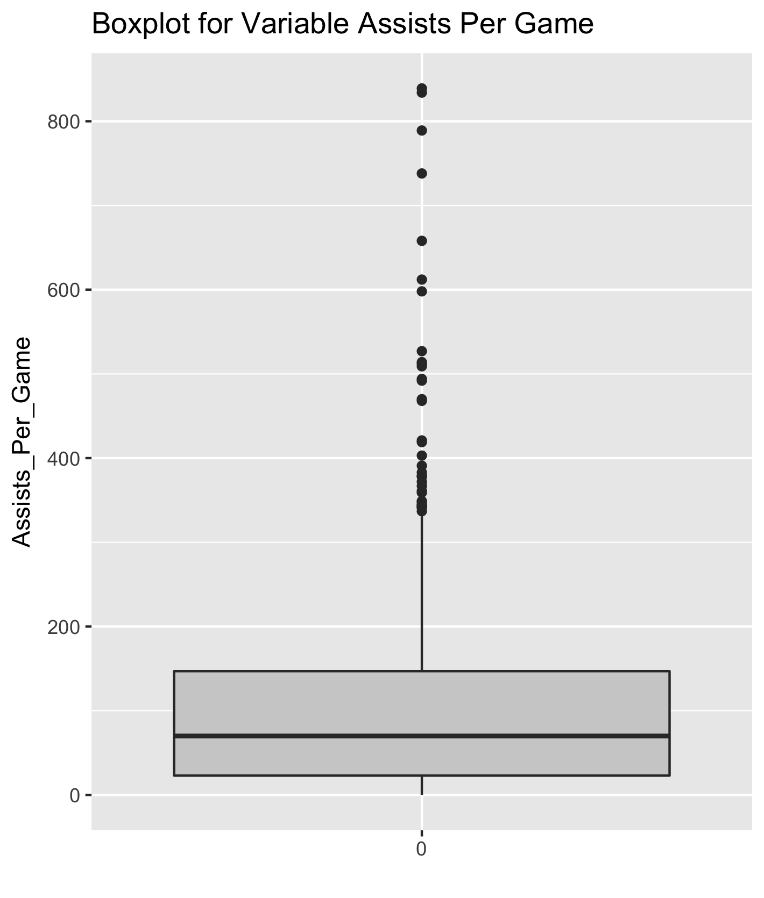  
***
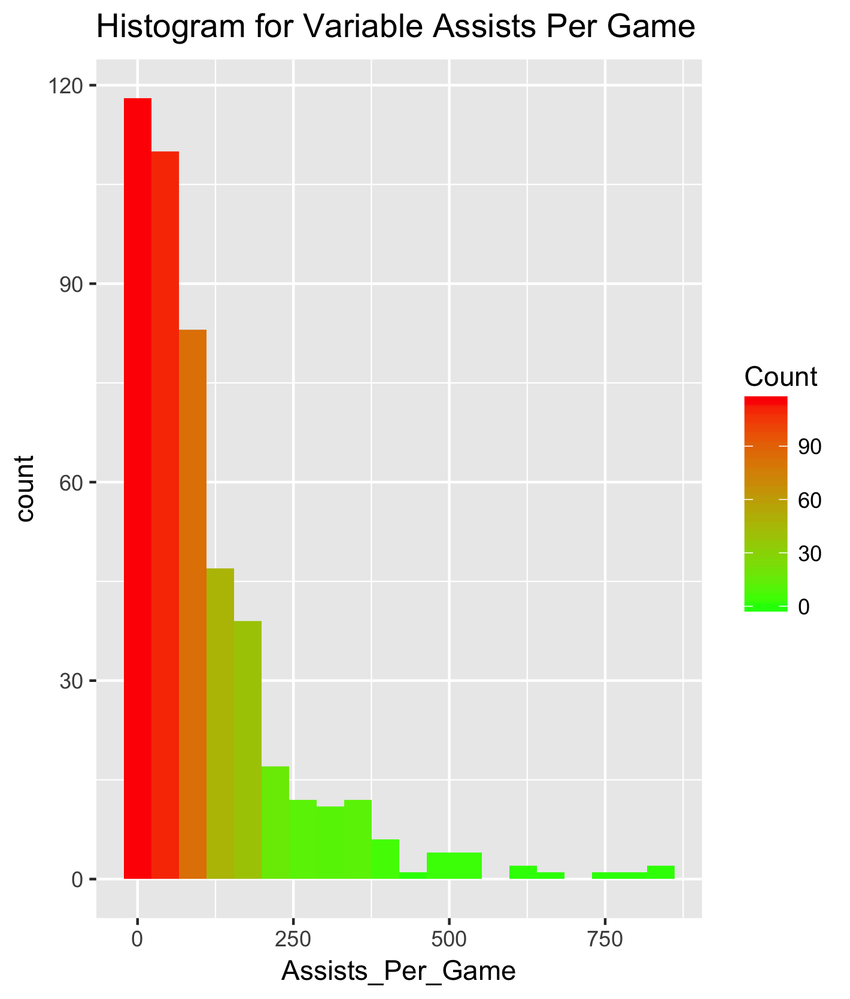

Player Performance
========================================================
We use "efficiency"(EFF) to evaluate a professional basketball player's value.

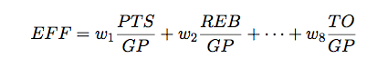 
 
 Wi: weights	                               
 sigma i: standard deviation                
 EFF: efficiency	 
 PTS: total points	 
 REB: total rebounds  
*** 
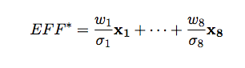 

 AST: assists 
 STL: steals		
 BLK: blocks		
 TO: turnovers		
 GP: games played  
 Missed FT: missed free throws		
 Missed FG: missed field goals

Shiny apps 
========================================================
- "team-salaris"
  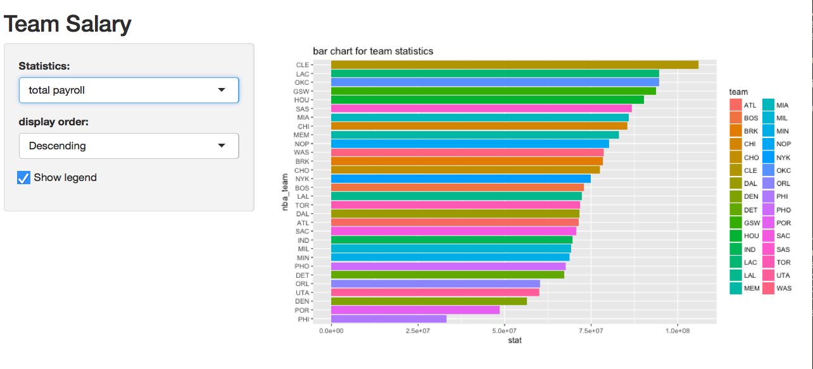 
  
Shiny apps 
========================================================
- "stat-salaries"
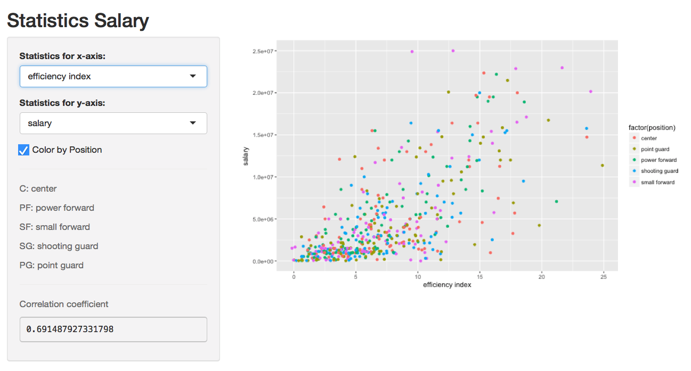

 
Results
========================================================

- Player skill analysis  
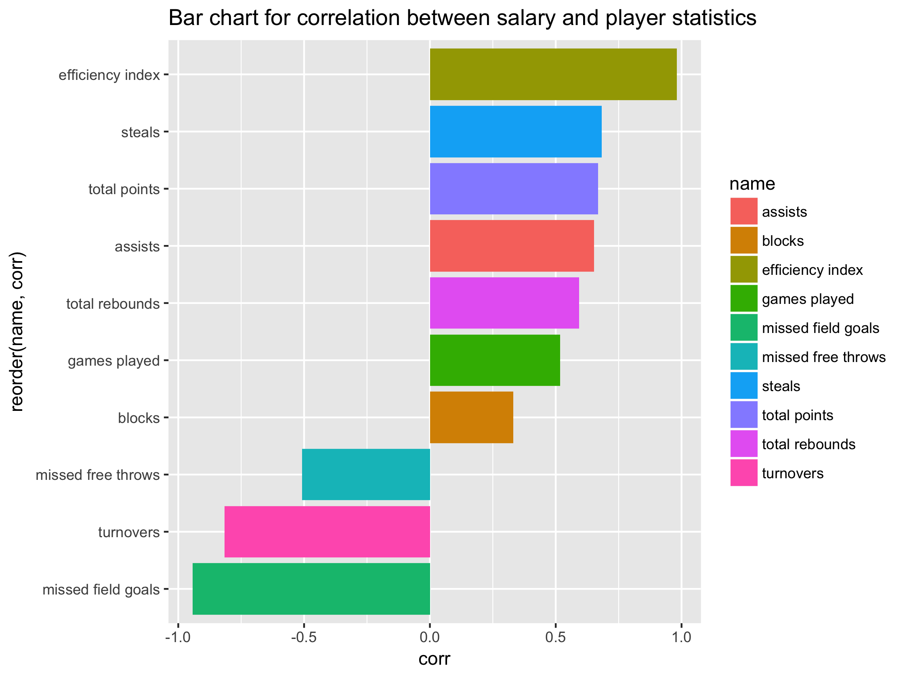
 

Results
========================================================

- Player underpaid or overpaid
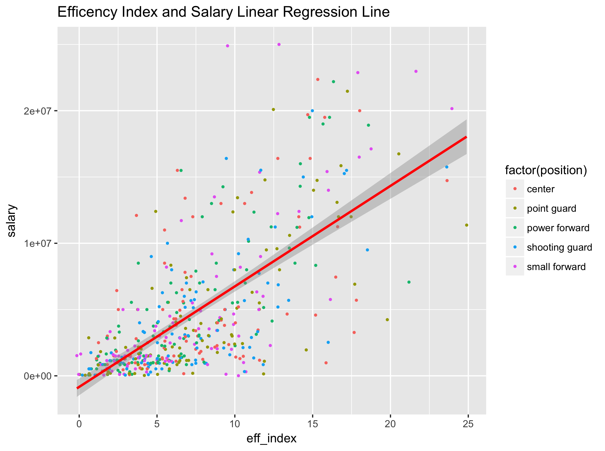

Results
========================================================

Player position analysis
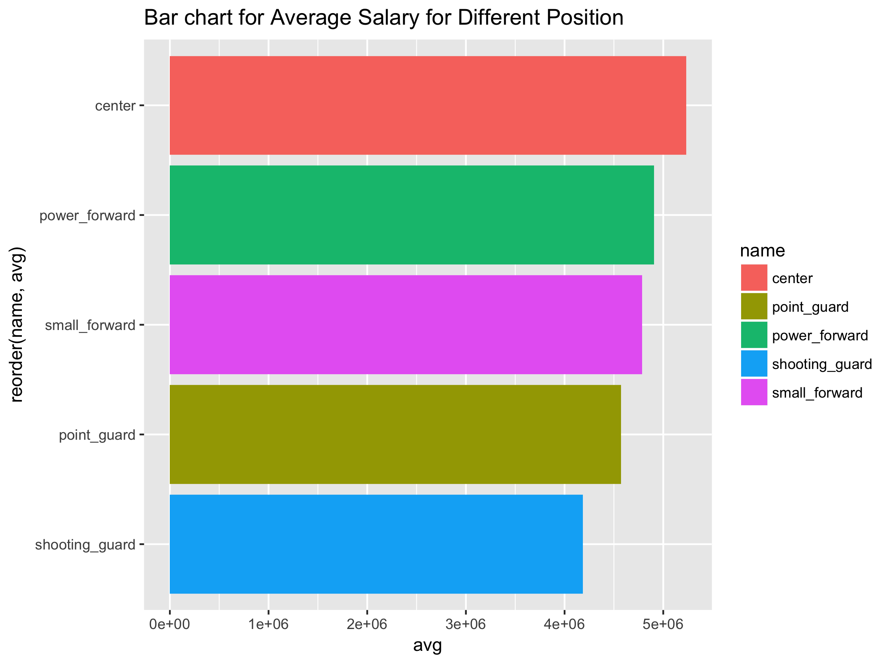  
*** 
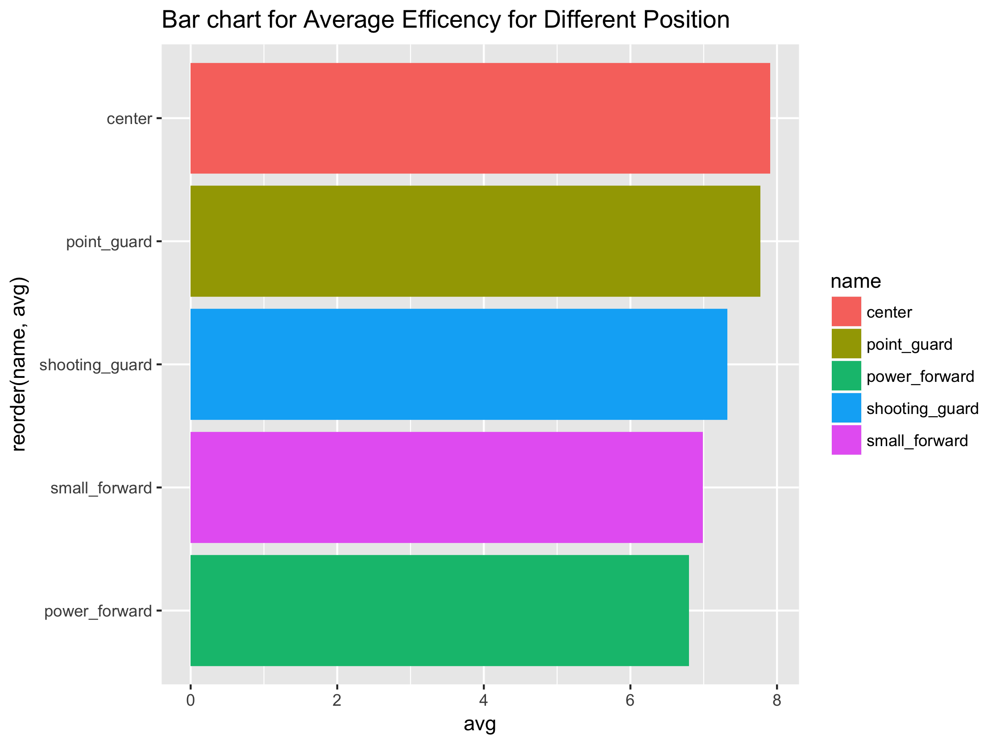

Results
========================================================

- Player position analysis
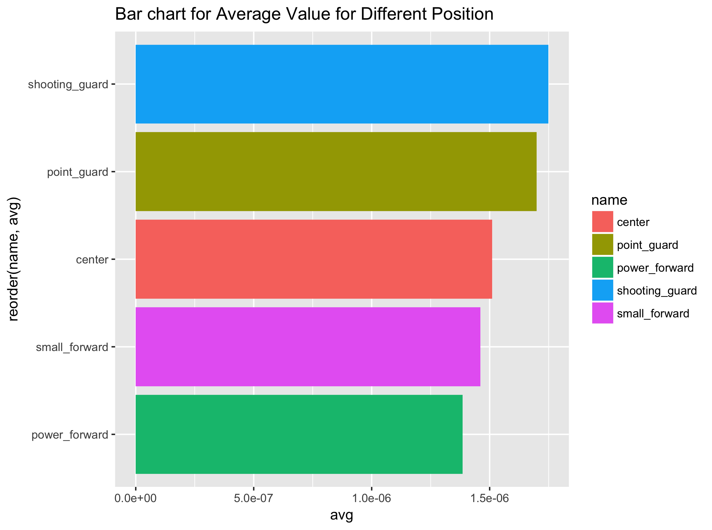

Conclusion
========================================================
- EFF projects the highest possitive correlation with salary
- Number of missed field goals has the strongest negative impact on salary 
- Low efficiency players are more likely to be underpaid 
- High efficiency players are more likely to be overpaid
- Point guards and Shooting guards are underpaid on average
- Power forward and Center players are overpaid on average  

Take home message
========================================================
- Except for efficiency, what else will affect the underpaid and overpaid?
- For example: age, height, .etc

